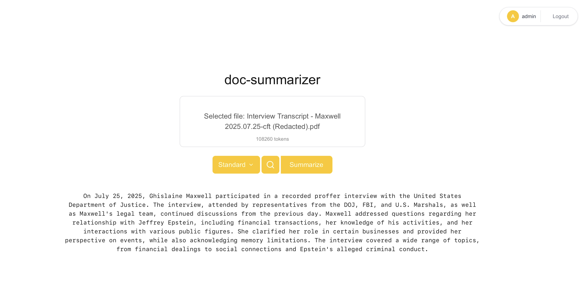

# Doc-Summarizer

**Doc-Summarizer** is a full-stack application designed for efficient document summarization and Q&A using advanced AI.



##### analyzed document: https://www.justice.gov/storage/audio-files/Interview%20Transcript/Interview%20Transcript%20-%20Maxwell%202025.07.25-cft%20(Redacted).pdf
---

## Project Status: Learning & Development
This is my personal project, built to explore and experiment with:

* **Context Window Management**
* **Prompt Engineering**
* **RAG (Retrieval-Augmented Generation)**: Pro Mode is now fully implemented with **Embeddings** and **Vector Search** using pgvector for deep retrieval over large documents that exceed standard context limits.

---

## Features

- **Document Support**: Extract and process text from `.txt`, `.md`, and `.pdf` files.
- **AI-Powered Summarization**: Get concise, meaningful summaries using **Google Gemini**.
- **Contextual Q&A**: Ask questions about your documents and get answers based strictly on the uploaded content.
- **Token Counting**: Real-time calculation of token usage to stay within API limits.
- **Streaming Responses**: Real-time text generation for a smooth, modern UI experience.
- **User Tiers**:
  - **Standard**: Direct context-window processing (15,000 token limit).
  - **Pro**: RAG-enhanced mode — documents are chunked, embedded, and stored in pgvector for semantic retrieval over large-scale data.

---

## Tech Stack

### Backend
- **Framework**: [FastAPI](https://fastapi.tiangolo.com/) (Python)
- **Database**: PostgreSQL with [pgvector](https://github.com/pgvector/pgvector) (The foundation for my future RAG mode)
- **ORM**: [SQLModel](https://sqlmodel.tiangolo.com/)
- **LLM Provider**: [Google Gemini API](https://ai.google.dev/) (`gemini-2.5-flash-lite`)
- **Embeddings**: `gemini-embedding-2-preview` (768 dimensions)
- **Authentication**: JWT-based security

### Frontend
- **Framework**: [Next.js 15+](https://nextjs.org/) (TypeScript)
- **Styling**: [Tailwind CSS 4](https://tailwindcss.com/)
- **UI Components**: React 19

---

## Project Structure

```text
├── backend/                # FastAPI application
│   ├── main.py             # Entry point & API routes
│   ├── database.py         # DB connection & initialization
│   ├── db_models.py        # SQLModel table definitions (User, Document, DocumentChunk)
│   ├── models.py           # Pydantic request/response models
│   ├── llm_service.py      # Google Gemini integration, embeddings & prompt logic
│   ├── security_utils.py   # JWT & Password hashing
│   ├── preprocessor.py     # Document processing (PDF, etc.)
│   └── rag/
│       └── rag_service.py  # Vector similarity retrieval via pgvector
├── frontend/               # Next.js application
│   ├── app/                # Next.js App Router
│   ├── components/         # Reusable React components
│   └── public/             # Static assets
└── alembic.ini             # Database migration config